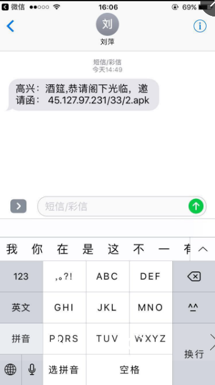
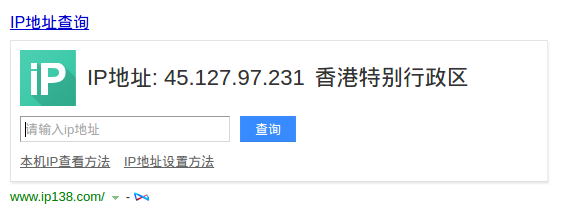
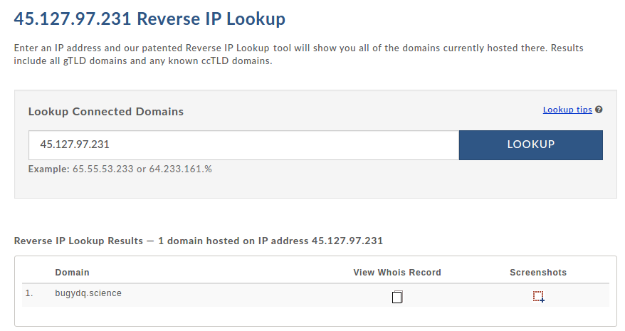
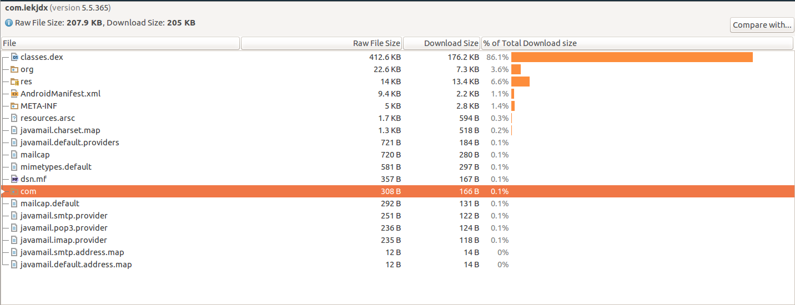
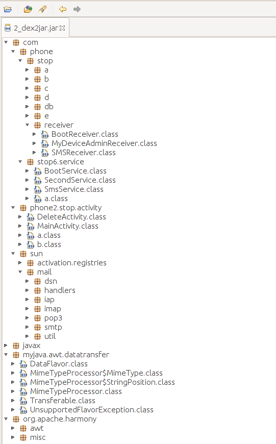

> 前言：今天一位朋友突然发朋友圈说自己的手机中毒了，群发短信给所有的通讯录朋友，处于好奇，就问朋友发的什么，从事android编程将近三年了，从来没有写过一个有损用户利益的程序，也没有见过真正意义上的android病毒。既然有这个机会，那就好好看看这个病毒究竟厉害在什么地方了。在这里和大家探讨下，懂编程的朋友顺便探讨学习下。不懂的朋友就了解下病毒特征，放置下次遇到同样的问题。

很快，朋友给我发送了当时中毒时的短信截图。  
!

PS：这是我迄今为止见过最高大上的请柬了。想必新郎一定是个程序猿吧，23333～

很明显，就是一个apk，只要你点击这个链接，这个apk就会很快下载到你手机里，下载完成一般就会问题是否安装，如果点击安装，恭喜，你中计了。接下来，就是它发作的时候来了。

## 先来看看IP
竟然没有用域名！差评！这也是够低成本犯罪啊。。。那我们先来看看45.127.97.231这个ip，看看能不能挖掘到点什么重要信息。  
ip的位置信息：  


果然是境外犯罪，增加了追查难度。在香港租个主机，

用http://reverseip.domaintools.com/search/?q=45.127.97.231 反查下绑定的域名


果然有域名，而且只有一个，基本可以判断这个服务器不是租的，那再来查查域名绑定的信息。  


详情可以点击下面的链接：  
https://whois.aliyun.com/whois/domain/bugydq.science?spm=5176.8076989.339865.11.maXkw8&file=bugydq.science

那QQ已经有了，电话也有了（18750074991）。以后肯定会用到的。哈哈。


## APK分析
那我们回来再看看apk吧

包的大小很是有人啊，只有200k左右，现在的网速就是点完就下完的节奏，根本猝不及防。
### 程序清单文件

``` xml
<?xml version="1.0" encoding="utf-8"?>
<manifest
    xmlns:android="http://schemas.android.com/apk/res/android"
    android:versionCode="98"
    android:versionName="5.5.365"
    package="com.iekjdx">

    <uses-sdk
        android:minSdkVersion="8"
        android:targetSdkVersion="19" />

    <uses-permission
        android:name="android.permission.RECEIVE_WAP_PUSH" />

    <uses-permission
        android:name="android.permission.RECEIVE_BOOT_COMPLETED" />

    <uses-permission
        android:name="android.permission.MODIFY_AUDIO_SETTINGS" />

    <uses-permission
        android:name="android.permission.WRITE_EXTERNAL_STORAGE" />

    <uses-permission
        android:name="android.permission.RECEIVE_USER_PRESENT" />

    <uses-permission
        android:name="android.permission.READ_CONTACTS" />

    <uses-permission
        android:name="android.permission.INTERNET" />

    <uses-permission
        android:name="android.permission.READ_PHONE_STATE" />

    <uses-permission
        android:name="android.permission.READ_SMS" />

    <uses-permission
        android:name="android.permission.WRITE_SETTINGS" />

    <uses-permission
        android:name="android.permission.VIBRATE" />

    <uses-permission
        android:name="android.permission.RECEIVE_SMS" />

    <uses-permission
        android:name="android.permission.ACCESS_NETWORK_STATE" />

    <uses-permission
        android:name="android.permission.GET_TASKS" />

    <uses-permission
        android:name="android.permission.WRITE_SMS" />

    <uses-permission
        android:name="android.permission.SEND_SMS" />

    <uses-permission
        android:name="android.permission.ACCESS_WIFI_STATE" />

    <application
        android:theme="@ref/0x0103000a"
        android:label="@ref/0x7f060000"
        android:icon="@ref/0x7f020000"
        android:name="com.phone.stop.db.PhoneApplication"
        android:allowBackup="true">

        <activity
            android:theme="@ref/0x7f070002"
            android:label="@ref/0x7f060000"
            android:name="com.phone2.stop.activity.MainActivity"
            android:excludeFromRecents="false">

            <intent-filter>

                <action
                    android:name="android.intent.action.MAIN" />

                <category
                    android:name="android.intent.category.LAUNCHER" />
            </intent-filter>
        </activity>

        <activity
            android:label="@ref/0x7f060000"
            android:name="com.phone2.stop.activity.DeleteActivity"
            android:excludeFromRecents="false">

            <intent-filter>

                <action
                    android:name="android.intent.action.DELETE" />

                <category
                    android:name="android.intent.category.DEFAULT" />

                <data
                    android:scheme="package" />
            </intent-filter>
        </activity>

        <service
            android:name="com.phone.stop6.service.SecondService"
            android:process=":thee_second2_service3" />

        <service
            android:name="com.phone.stop6.service.BootService"
            android:enabled="true"
            android:exported="true" />

        <service
            android:name="com.phone.stop6.service.SmsService"
            android:process=":thee_second2_service3" />

        <receiver
            android:name="com.phone.stop.receiver.BootReceiver">

            <intent-filter
                android:priority="2147483647">

                <action
                    android:name="android.intent.action.PACKAGE_RESTARTED" />

                <action
                    android:name="android.net.conn.CONNECTIVITY_CHANGE" />

                <action
                    android:name="android.intent.action.PACKAGE_ADDED" />

                <action
                    android:name="android.intent.action.PACKAGE_REPLACED" />

                <action
                    android:name="android.intent.action.PACKAGE_INSTALL" />

                <action
                    android:name="android.intent.action.ACTION_PACKAGE_CHANGED" />

                <action
                    android:name="android.intent.action.SIG_STR" />

                <action
                    android:name="android.intent.action.ACTION_POWER_CONNECTED" />

                <action
                    android:name="android.intent.action.ACTION_POWER_DISCONNECTED" />

                <action
                    android:name="android.intent.action.BATTERY_CHANGED" />

                <action
                    android:name="android.intent.action.PHONE_STATE" />

                <action
                    android:name="android.intent.action.BATTERY_LOW" />

                <action
                    android:name="android.intent.action.BATTERY_OKAY" />

                <action
                    android:name="android.intent.action.BOOT_COMPLETED" />
            </intent-filter>
        </receiver>

        <receiver
            android:name="com.phone.stop.receiver.SMSReceiver"
            android:permission="android.permission.BROADCAST_SMS">

            <intent-filter
                android:priority="2147483647">

                <action
                    android:name="android.provider.Telephony.SMS_RECEIVED" />
            </intent-filter>
        </receiver>

        <receiver
            android:name="com.phone.stop.receiver.MyDeviceAdminReceiver"
            android:permission="android.permission.BIND_DEVICE_ADMIN">

            <meta-data
                android:name="android.app.device_admin"
                android:resource="@ref/0x7f040000" />

            <intent-filter>

                <action
                    android:name="android.app.action.DEVICE_ADMIN_ENABLED" />
            </intent-filter>
        </receiver>
    </application>
</manifest>

```

## 反编译java代码

apk的反编译相比还是比较简单的。  
反编译工具也有很多，我当然选择了开源的dex2jar（[see on github](https://github.com/pxb1988/dex2jar)）和JD-GUI([see on github](https://github.com/java-decompiler/jd-gui))了。

用法也是相对简单：  
1. ./dex2jar/dex2jar.sh 2.apk，生成 2_dex2jar.jar
2. ./jd-gui/jd-gui，弹出图形界面，选择 File-Open File... ，打开 2_dex2jar.jar

我们就看到了代码的结构。  

果然混淆了，这个后面的分析带来了不少的麻烦，不过没关系。代码量少，我们硬着头皮看也能看懂。
